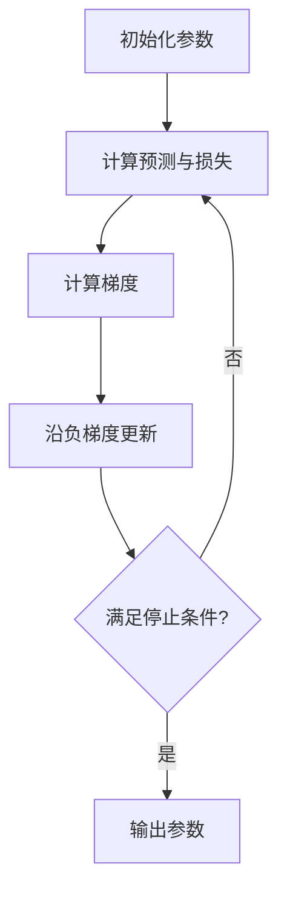

# 梯度下降

## 条目概览

梯度下降通过重复计算目标函数对参数的梯度，并沿梯度的反方向移动参数来降低目标值。它是许多机器学习模型的基础优化方法。

## 为什么需要它

当模型参数很多、闭式解不存在或代价过高时，无法一次直接算出最优参数。梯度下降把问题转化为一系列可计算的小步更新。

## 直观理解

把损失函数想象成地形，参数是当前位置。梯度指向局部上升最快方向，因此负梯度指向局部下降最快方向。学习率决定每一步走多远。

## 正式定义

若目标函数为 $J(\boldsymbol\theta)$，学习率为 $\eta>0$，则第 $t$ 次更新为：

$$
\boldsymbol\theta_{t+1}=\boldsymbol\theta_t-\eta\nabla J(\boldsymbol\theta_t)
$$

## 核心组成

- 参数 $\boldsymbol\theta$：需要优化的未知量。
- 目标函数 $J$：评价当前参数好坏。
- 梯度 $\nabla J$：每个参数方向的偏导数组成的 [[向量]]。
- 学习率 $\eta$：控制单步更新幅度。
- 停止条件：最大轮数、梯度足够小或目标值变化足够小。

## 工作流程



## 完整计算示例

设 $J(\theta)=(\theta-3)^2$，则 $J'(\theta)=2(\theta-3)$。从 $\theta_0=0$ 开始，取 $\eta=0.1$：

1. 梯度 $J'(0)=-6$，所以 $\theta_1=0-0.1\times(-6)=0.6$。
2. 梯度 $J'(0.6)=-4.8$，所以 $\theta_2=0.6+0.48=1.08$。
3. 参数会逐步接近最小点 $\theta=3$。

## 代码或工程中的表现

```python
theta = 0.0
learning_rate = 0.1

for _ in range(100):
    gradient = 2 * (theta - 3)
    theta -= learning_rate * gradient
```

## 与相似概念的区别

批量梯度下降每次使用全部样本；随机梯度下降每次使用一个样本；小批量梯度下降在计算效率和梯度稳定性之间折中。三者使用的更新原则相同，梯度估计方式不同。

## 常见误区

- 学习率不是越大越快；过大会越过最低点甚至发散。
- 梯度为零不一定是全局最小点，也可能是局部极值或鞍点。
- 损失下降缓慢不一定说明公式错误，也可能来自特征尺度不一致。

## 边界与限制

梯度下降依赖可微或可用次梯度处理的目标函数。非凸问题通常不能保证找到全局最优点。结果还受到初始化、学习率策略和数值精度影响。

## 前置、相关与后续学习

先理解 [[向量]] 和 [[均方误差]]，再观察 [[线性回归#梯度下降求解]] 如何把梯度下降用于模型训练。

## 更新记录

- 2026-07-17：建立算法条目并补充迭代示例。
