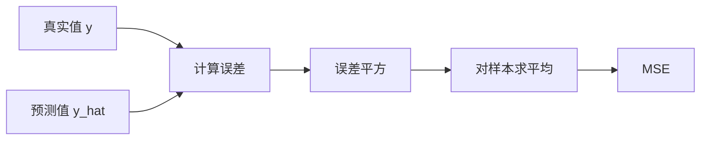

# 均方误差

## 条目概览

均方误差（MSE）衡量预测值与真实值之间的平均平方距离。它把正负误差都变成非负量，并对较大的误差施加更强惩罚。

## 为什么需要它

训练回归模型时，需要一个可比较的数值回答“当前预测有多差”。MSE 连续、可微，适合与 [[梯度下降]] 配合优化，也是 [[线性回归]] 的经典目标函数。

## 直观理解

先计算每个样本的预测误差，再把误差平方，最后求平均。平方会消除符号抵消：预测高 2 与预测低 2 都贡献 $4$。

## 正式定义

对 $m$ 个样本，真实值为 $y_i$，预测值为 $\hat y_i$：

$$
\operatorname{MSE}=\frac{1}{m}\sum_{i=1}^{m}(\hat y_i-y_i)^2
$$

有些推导会使用 $\frac{1}{2m}$，只是为了让求导时的系数 2 抵消，不改变最优点位置。

## 核心原理



## 完整计算示例

真实值为 $(3,5,2)$，预测值为 $(2,5,4)$。误差是 $(-1,0,2)$，平方误差是 $(1,0,4)$，因此：

$$
\operatorname{MSE}=\frac{1+0+4}{3}=\frac{5}{3}\approx1.667
$$

## 代码或工程中的表现

```python
def mse(y_true, y_pred):
    squared_errors = [(prediction - truth) ** 2
                      for truth, prediction in zip(y_true, y_pred)]
    return sum(squared_errors) / len(squared_errors)
```

## 与相似概念的区别

| 指标 | 特点 | 对异常值的敏感度 |
| --- | --- | --- |
| MSE | 平方后平均，易于求导 | 高 |
| RMSE | MSE 开平方，与目标同量纲 | 高 |
| MAE | 绝对误差平均 | 相对较低 |

## 常见误区

- MSE 越小通常只表示在同一数据和尺度下拟合更好，不能跨任务直接比较。
- MSE 为零才表示所有预测完全相等；较小不等于没有偏差。
- 训练损失低不保证测试集表现好。

## 边界与限制

平方项会放大异常值的影响。若数据含有严重离群点，MSE 可能使模型过度追逐少量极端样本。目标量纲改变时，MSE 的数值也会按量纲平方改变。

## 前置、相关与后续学习

理解 [[向量]] 有助于把整批预测写成矩阵形式。MSE 与 [[线性回归]] 的参数估计、[[梯度下降]] 的更新方向直接相关。

## 更新记录

- 2026-07-17：建立公开条目与完整计算示例。
